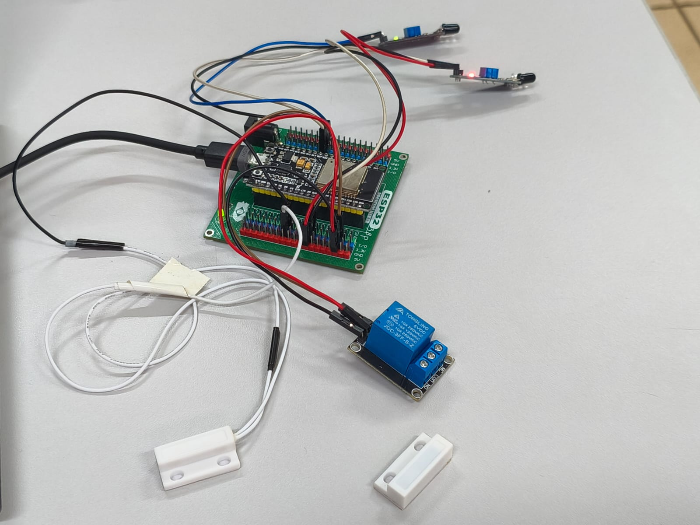
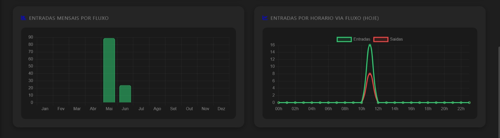
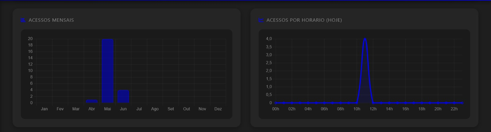

# Fatec CityLab Security Access: IoT Access Control System

## Project Overview

The **Fatec CityLab Security Access** project is a prototype automation and access control system developed for controlled public environments, aiming to improve security and management in Smart Cities. By leveraging Internet of Things (IoT) technologies, the system provides real-time monitoring, physical access control, and event traceability, contributing to resource optimization and government decision-making.

## Key Features

The system was designed to provide the following capabilities:

* **Processing and Connectivity (ESP32):** Acts as the central processing unit, performing edge computing tasks while managing wireless (Wi-Fi) communication for IoT connectivity.

* **Door Status Detection (MC-38A):** Continuously monitors the physical state of the access point (door open or closed) using a magnetic proximity sensor.

* **Flow Detection and Counting (LM393):** A pair of infrared barrier sensors detects presence and movement direction (entry/exit), maintaining a bidirectional occupancy count.

* **Physical Access Control (Relay Module):** Power interface responsible for activating (unlocking or locking) the electromagnetic door lock based on logical commands received from the microcontroller.

* **Cloud Data Transmission and Storage:** Door state changes, occupancy updates, and relay activations are transmitted via the MQTT protocol to Arduino IoT Cloud (real-time monitoring) and Supabase (data persistence and historical storage).

## Business Rules and Objectives

The project's primary objectives include:

* **Enhancing security in public spaces:** Reduce vulnerabilities in institutional environments (such as city halls, museums, and libraries) through an autonomous, connected, and intelligent system.

* **Real-time occupancy monitoring:** Provide instant occupancy information to support facility management and compliance with safety regulations.

* **Ensuring traceability and auditing:** Maintain an immutable cloud-based history of access logs and events to identify intrusion attempts, open doors, and peak usage periods.

* **Optimizing urban resource management:** Transform physical interactions into digital intelligence, enabling the generation of reports and dashboards to support government decision-making.

## Hardware Components

| Component | Price (BRL) | Supplier |
| :-------------------------------- | :--------- | :----------------- |
| Jumper Wires (Male/Female, 40 pcs, 20 cm) | 8.60 | Eletrogate |
| Jumper Wires (Male/Female, 40 pcs, 20 cm) | 7.50 | MakerHero |
| Jumper Wires (Female/Female, 40 pcs, 20 cm) | 7.90 | Eletrogate |
| Jumper Wires (Female/Female, 40 pcs, 20 cm) | 7.90 | MakerHero |
| ESP32 WROOM | 59.90 | Eletrogate |
| ESP32 Expansion Board | 99.00 | Projetos Maker |
| USB Power Cable for ESP32 | 9.99 | Casa da Robótica |
| MC-38A Magnetic Sensor | 7.90 | Eletrogate |
| LM393 Infrared Barrier Sensor (5-unit kit) | 29.00 | Mercado Livre |
| Single-Channel 5V Relay Module | 12.90 | Eletrogate |

## Physical Prototype Architecture

The physical prototype was assembled in a laboratory environment, simulating the structure of an institutional door frame. The main architectural components include:

* **Central Unit:** The ESP32 microcontroller is mounted on an Expansion Board, providing organized GPIO distribution and stable power delivery.

* **Infrared Barrier Sensors (LM393):** Two infrared modules positioned in parallel across the doorway and connected to the ESP32 digital pins.

* **Magnetic Sensor (MC-38A):** Installed on the door frame and the door leaf to provide binary readings of the physical access state.

* **Actuator (Relay Module):** Connected to operate as the switch for the electromagnetic lock, electrically isolating the high-power circuit from the low-voltage control circuit.

## Web Platform (Administrative Interface)

The system includes an interactive administrative dashboard that provides:

* **Status Rendering and Real-Time Monitoring:** Displays the access point status (e.g., "Main Door - Lab 01", "Open/Closed", "Free/Blocked").

* **Historical Data Visualization:** Analytical charts displaying "Access History (Last 24 Hours)" for occupancy and people flow metrics.

* **Remote Access Control Commands:** Quick unlock shortcuts and extended access control buttons, providing immediate synchronization between the web platform and the physical prototype.

## Technologies Used

* **Microcontroller:** ESP32
* **Programming Languages:** C++ (ESP32 firmware), JavaScript, CSS, HTML, TypeScript (web platform)
* **Communication Protocol:** MQTT
* **Cloud Services:** Arduino IoT Cloud, Supabase (PostgreSQL)
* **Sensors:** MC-38A Magnetic Sensor, LM393 Infrared Barrier Sensor
* **Actuators:** Single-Channel 5V Relay Module

## Installation and Configuration (Overview)

To replicate this project, you will need to:

1. Configure the Arduino IDE development environment for the ESP32.
2. Configure the Wi-Fi credentials and cloud service access (Arduino IoT Cloud and Supabase) in the ESP32 firmware.
3. Configure the web platform to communicate with Supabase and Arduino IoT Cloud.

## Functional Testing

Laboratory bench tests validated the system's behavior, including:

* **People Flow Detection:** The C/C++ algorithm successfully processed the interruption sequence of the LM393 infrared beams, accurately counting entries and exits while applying debouncing techniques.

* **Perimeter Integrity:** The MC-38A magnetic sensor correctly detected the "open/closed" door state and transmitted it to the cloud in real time.

* **Remote Access Control:** Access release commands sent from the cloud-based dashboard were received by the ESP32, activating the relay and simulating the unlocking of the electromagnetic door lock.

* **Cloud Data Persistence:** Critical events were successfully stored in Supabase with timestamps, ensuring complete traceability and auditability.

## Authors

* **Student 1:** Eduardo Rosales Capatti
* **Student 2:** Lucas de Melo Carvalho
* **Academic Advisor:** Prof. Dr. Mário Henrique de Souza Pardo
